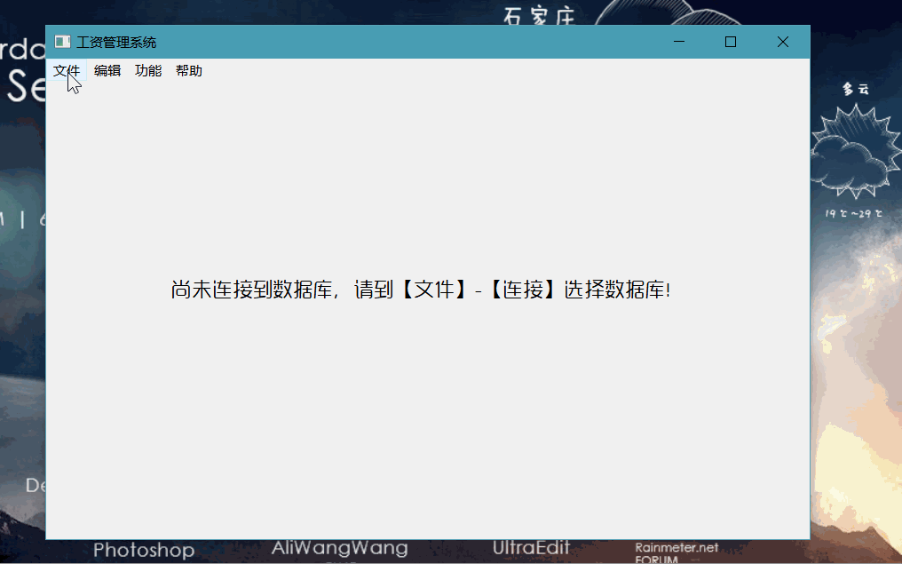

# Qt入门实践

## 参考书目：

1. 霍亚飞-Qt Creator快速入门
2. C++ GUI Qt 4 编程 【译】
3. Qt Quick 开发实践

## 博客地址：

[www.cnblogs.com/lxmwb](http://www.cnblogs.com/lxmwb)

## 目录结构：

### 源码：

1. addressBook（简单通讯录的实现）

2. TextEdit（文档编辑器NotePad的实现）

   

3. SalaryManageSystem（工资管理系统）

   

4. 待定。。。

### 知识梳理：

1. C++ 多重定义

更多内容请访问我的博客！