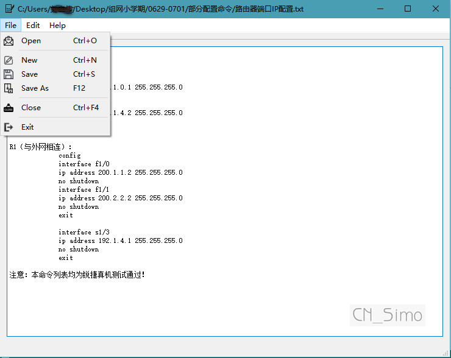
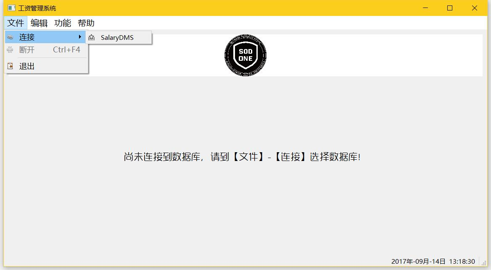

# Qt入门实践

## 参考书目：

1. 霍亚飞-Qt Creator快速入门
2. C++ GUI Qt 4 编程 【译】
3. Qt Quick 开发实践

## 博客地址：

[www.cnblogs.com/lxmwb](http://www.cnblogs.com/lxmwb)

## 目录结构：

### 源码：

1. addressBook（简单通讯录的实现）

2. TextEdit（文档编辑器NotePad的实现）

   

3. SalaryManageSystem（工资管理系统）

   

   ### 2017.9.12 更新日志 【1.17.0912 beta】

   - **修复** 连接失败后出现连接成功界面的bug；
   - 菜单栏按钮添加图标；
   - **新增** “关于SalaryManageSystem” 对话框；
   - **修复** 连接成功后关闭窗口时出现无响应 的bug；
   - 实现编辑菜单中的复制粘贴等功能；
   - **新增** 状态栏提示，右下角永久显示实时时间；

4. 待定。。。

### 知识梳理：

1. C++ 多重定义

更多内容请访问[我的博客](http://www.cnblogs.com.lxmwb)！